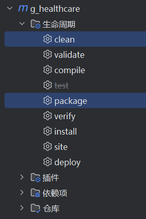
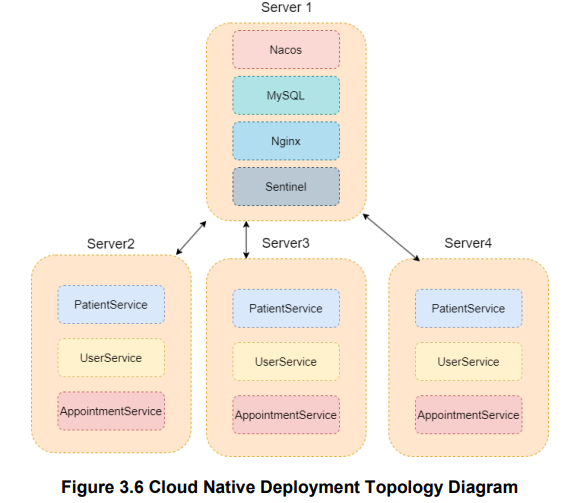
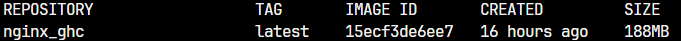
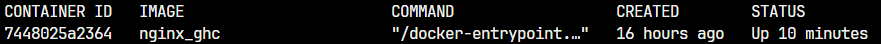
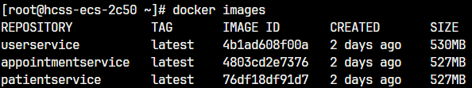
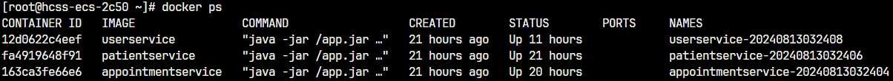
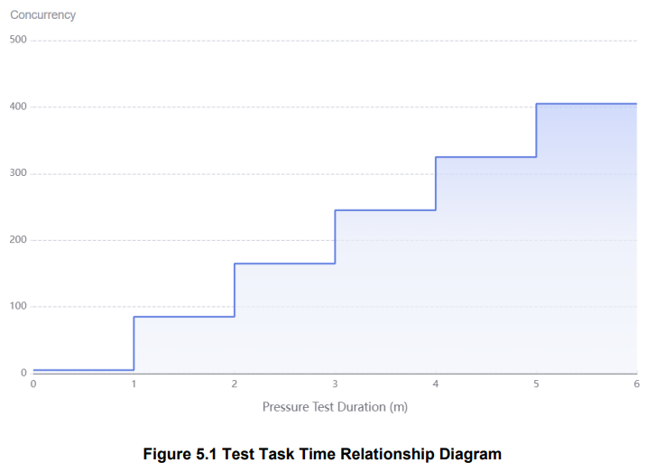

# 1. Object

Can a cloud native architecture improve elasticity and stability in the context of a simulated Electronic Health Record(EHR) system?

## 1.1 Design


# 2. Database Prepare

Run the SQL File`Database/data.sql`in MySQL Server

# 3. Prototype

change the `application.properties` file in `/Prototype/src/main/resources`

```properties
#Service configuration
##service name
spring.application.name=backend_healthcare
##service port
server.port=6061
#Database configuration
##MySQL database configuration
spring.datasource.url=jdbc:mysql://localhost:3306/{DatabaseName}?useUnicode=true&characterEncoding=utf8&serverTimezone=GMT%2B8
spring.datasource.username=root
spring.datasource.password=6021
spring.datasource.driver-class-name=com.mysql.cj.jdbc.Driver
##(Database framework)Mybatis log configuration
#mybatis-plus.configuration.log-impl=org.apache.ibatis.logging.stdout.StdOutImpl
```

Use Maven to clean the dependencies and package the project



Get the `jar` file in `/Prototype/target/`

Use command below in any Server which have Java:17 environment

```shell
java -jar app.jar
```

And the Running logs will be show in the terminal

# 4. Move to Cloud Native Architecture

## 4.1 Server Prepare and Design

The project uses four CentOS 8.2 cloud servers. One server is used to deploy cloud native components Nacos, Sentinel, and Nginx. The other three servers are used to deploy microservices.



## 4.2 Docker

Install docker dependencies

```shell
#centos
yum install -y yum-utils device-mapper-persistent-data lvm2
yum install docker-ce
```

Enable start docker service automatically

```shell
systemctl enable docker.service
```

Check the status of docker.service

```shell
systemctl status docker.service
```

## 4.3 MySQL(Move to Docker)

docker pull mysql image

```shell
docker pull mysql:8.0.28
```

run MySQL command

```shell
docker run -p 3306:3306 --name mysql --restart=unless-stopped --privileged=true \
-v /opt/docker/mysql8.0.28/mysql:/etc/mysql \
-v /opt/docker/mysql8.0.28/logs:/logs \
-v /opt/docker/mysql8.0.28/data:/var/lib/mysql \
-e MYSQL_ROOT_PASSWORD=6021 -d mysql:8.0.28
```

check running status and logs

```shell
docker ps
docker logs `name`
```

## 4.4 Nacos

Pull Nacos image

```shell
docker pull nacos/nacos-server:v2.1.1
```

Run command

```shell
docker run -d -p 8848:8848 -p 9848:9848 --name nacos --restart=unless-stopped \
-e jvm_xms=256m \
-e jvm_xmx=256m \
-e MODE=standalone \
nacos/nacos-server:v2.1.1
```

## 4.5 Sentinel

pull Sentinel image

```shell
docker pull bladex/sentinel-dashboard
```

run Sentinel

```shell
docker run --name sentinel --restart=unless-stopped -d -p 8858:8858 -p 8719:8719 -d bladex/sentinel-dashboard
```

## 4.6 Nginx

Pull Official Nginx Image

```bash
docker pull nginx:latest
```

Use `DockerFile` to build image

```dockerfile
#/-- DockerFile
#	/-- Nginx
#		/-- DockerFile
#use the official Nginx image as the base image
FROM nginx:latest
#Copy local nginx configuration file to the container
COPY nginx.conf /etc/nginx/nginx.conf
# Expose ports.
EXPOSE 80
EXPOSE 8081
EXPOSE 7071
EXPOSE 9091
# Define default command.
CMD ["nginx", "-g", "daemon off;"]
```

Update `nginx.conf`, it s the Nginx configuration file

```nginx
worker_processes 1;
events {
    worker_connections 1024;
}
http {
    upstream backend_servers_8081 {
        server 192.168.1.101:8081;
        server 192.168.1.100:8081;
        server 192.168.9.67:8081;
    }
    upstream backend_servers_9091 {
        server 192.168.1.101:9091;
        server 192.168.1.100:9091;
        server 192.168.9.67:9091;
    }
    upstream backend_servers_7071 {
        server 192.168.1.101:7071;
        server 192.168.1.100:7071;
        server 192.168.9.67:7071;
    }
    server {
        listen 80;
        listen 8081;
        server_name localhost;
        location / {
            proxy_pass http://backend_servers_8081;
            proxy_set_header Host $host;
            proxy_set_header X-Real-IP $remote_addr;
            proxy_set_header X-Forwarded-For $proxy_add_x_forwarded_for;
            proxy_set_header X-Forwarded-Proto $scheme;
        }
    }
    server {
        listen 7071;
        server_name localhost;

        location / {
            proxy_pass http://backend_servers_7071;
            proxy_set_header Host $host;
            proxy_set_header X-Real-IP $remote_addr;
            proxy_set_header X-Forwarded-For $proxy_add_x_forwarded_for;
            proxy_set_header X-Forwarded-Proto $scheme;
        }
    }
    server {
        listen 9091;
        server_name localhost;

        location / {
            proxy_pass http://backend_servers_9091;
            proxy_set_header Host $host;
            proxy_set_header X-Real-IP $remote_addr;
            proxy_set_header X-Forwarded-For $proxy_add_x_forwarded_for;
            proxy_set_header X-Forwarded-Proto $scheme;
        }
    }
}
```

Build My Nginx Image

```shell
/--Nginx
	/--nginx.conf
	/--DockerFile

#bulid command
docker build -t nginx_ghc .
#check docker images
docker ps
```



```bash
#run commmand
docker run -d --name docker_ghc -p 80:80 -p 9091:9091 -p 7071:7071 -p 8081:8081 nginx
#check running status
```



## 4.7 Micro Service Prepare And Containerize

Before this stage, check the docker running status by command  `docker ps` , make sure that all component run successfully


Update the  `application.properties`  file

```properties
/--Cloud_Native_Architecture
	/--appointmentservice1
		/--application.properties server.port=9091
	/--patientservice1
		/--application.properties server.port=7071
	/--userservice1
		/--application.properties server.port=8081
```

and sentinel, nacos, mysql configuration

```properties
#Sentinel configuration
##port for uploading runtime information to sentinel dashboard
spring.cloud.sentinel.transport.port=8719
##remote address of sentinel dashboard
spring.cloud.sentinel.transport.dashboard=192.168.0.100:8858

#Nacos configuration
##remote address of nacos server
spring.cloud.nacos.discovery.server-addr=192.168.0.100:8848
spring.cloud.loadbalancer.nacos.enabled=true

#Database configuration
##MySQL database configuration
spring.datasource.url=jdbc:mysql://192.168.0.100:3306/health_g?useUnicode=true&characterEncoding=utf8&serverTimezone=GMT%2B8
spring.datasource.username=root
spring.datasource.password=6021
spring.datasource.driver-class-name=com.mysql.cj.jdbc.Driver
###(Database framework)Mybatis log configuration
#mybatis-plus.configuration.log-impl=org.apache.ibatis.logging.stdout.StdOutImpl
```

Maven run `clean` and `package` to get `userService.jar ` , `patientService.jar` and `appointmentService.jar`

Upload it in the Linux Server and use Docker to build container by **DockerFile**

```dockerfile
#java version is 17
FROM openjdk:17

#copy all jar files
COPY *.jar /app.jar

#server port
CMD ["--server.port=9091"]

#container expose port
EXPOSE 9091

#container run command
ENTRYPOINT ["java","-jar","/app.jar"]
```

**DockerFile** is in `Cloud_Native_Architecture/userservice1/DockerFile` `Cloud_Native_Architecture/patientservice1/DockerFile` `Cloud_Native_Architecture/appointmentservice1/DockerFile`

```shell
#place the jar file and DockerFile in same Folders
/--patientservice
	/--patientService.jar
	/--DockerFile
/--userservice
	/--userService.jar
	/--DockerFile
/--appointmentservice	
	/--appointmentService.jar
	/--Dockerfile
	
#Build All Service to image
docker build -t patientservice /root/patientservice && \
docker build -t appointmentservice /root/appointmentservice && \
docker build -t userservice /root/userservice

#show all exist images
docker images
```



Run Command

```shell
#docker command
docker run -d -p 8081:8081 --network=host --restart=unless-stopped --name  userservice
docker run -d -p 7071:7071 --network=host --restart=unless-stopped --name  patientservice
docker run -d -p 9091:9091 --network=host --restart=unless-stopped --name  appointmentservice

#show all running container
docker ps
```



And run it in another server

# 5. Frontend

Use [adrianhajdin/healthcare](https://github.com/adrianhajdin/healthcare) project to build the frontend, simulating real-world EHR system scenarios

```bash
cd g_healthcare_ar/FrontEnd

npm install

npm run dev
```

# 6. Performance testing

Use [CodeArts TestPlan](https://www.huaweicloud.com/intl/en-us/product/cloudtest.html) to do the performance testing. And compare cloud native architecture system with prototype

## 6.1 Test Task

```properties
Prototype: HTTP Post request, request URL: “http://123.249.78.235:6061/user/”
Cloud-Native Architecture: HTTP Post request, request URL: “http://114.116.231.193/user”

Request Body:{
"userId": "$UUID",
"email": "$UUID@gmail.com",
"phone": "+&random number in 1-50 $UUID",
"name": "$UUID"
}

Starting Concurrency: 5
Total Concurrency Increment: 400
Duration per Stage: 1 minute
Increment Rate: 20%
```



## 6.2 Testing result

Performance: The Cloud Native Architecture clearly outperforms in all key performance  metrics. It has a higher success rate (100% vs. 98.71%), shorter average response time, and  lower maximum response time. Additionally, there were no instances of connection refusal or  response timeout. 

Stability: The Cloud Native Architecture shows significantly better stability compared to the  Prototype Architecture. This is evident from its 0 failed requests and no warning states. The  maximum response times at various TP levels are all lower than those of the Prototype,  especially at TP99, TP99.9, and TP99.99, where the response time differences are  significant. This indicates that even under high load and high concurrency, the Cloud Native  Architecture maintains stable performance. 

Conclusion: Based on these comparative results, it can be concluded that the Cloud Native  Architecture has clear advantages in terms of performance, stability, and resource utilization.  It provides better support and lower response times in high concurrency and high load  environments. These advantages make the Cloud Native Architecture more suitable for  modern applications, especially in scenarios requiring high load, high scalability, and high  reliability.

Detail in  [Cloud Native Architecture Performance Testing Report.pdf](Performance Testing Report\Cloud Native Architecture Performance Testing Report.pdf)  and [Prototype Performance Testing Report.pdf](Performance Testing Report\Prototype Performance Testing Report.pdf) 

# 7. Running Script

This is the script for running and building the application which can be used as a reference

`/DockerFile/container_run_shell`

```bash
+---/DockerFile/container_run_shell
|       			appointmentservice.sh
|       			build all service image.sh
|       			patientservice.sh
|       			stop & delete & remove all service image.sh
|       			userservice.sh
```

```shell
#build all service
docker build -t patientservice /root/patientservice && \
docker build -t appointmentservice /root/appointmentservice && \
docker build -t userservice /root/userservice
############################################################################################################
#run appointmentservice
PREFIX="appointmentservice"
SUFFIX=$(date +%Y%m%d%H%M%S)
NAME="$PREFIX-$SUFFIX"
docker run -d -p 9091:9091 --network=host --restart=unless-stopped --name "$NAME" appointmentservice
############################################################################################################
#run userservice
PREFIX="userservice"
SUFFIX=$(date +%Y%m%d%H%M%S)
NAME="$PREFIX-$SUFFIX"
docker run -d -p 8081:8081 --network=host --restart=unless-stopped --name "$NAME" userservice
############################################################################################################
#run appointmentservice
PREFIX="patientservice"
SUFFIX=$(date +%Y%m%d%H%M%S)
NAME="$PREFIX-$SUFFIX"
docker run -d -p 7071:7071 --network=host --restart=unless-stopped --name "$NAME" patientservice
############################################################################################################
#stop & remove all service and images
docker stop $(docker ps -q) && docker rm $(docker ps -aq) && docker rmi $(docker images -q --filter=reference='*service*')
```


